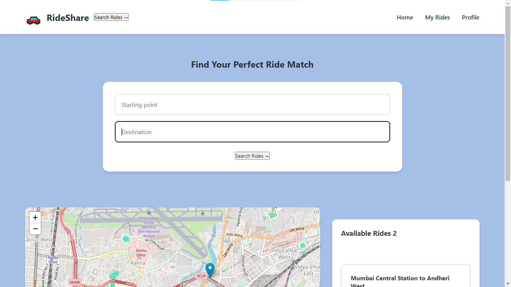
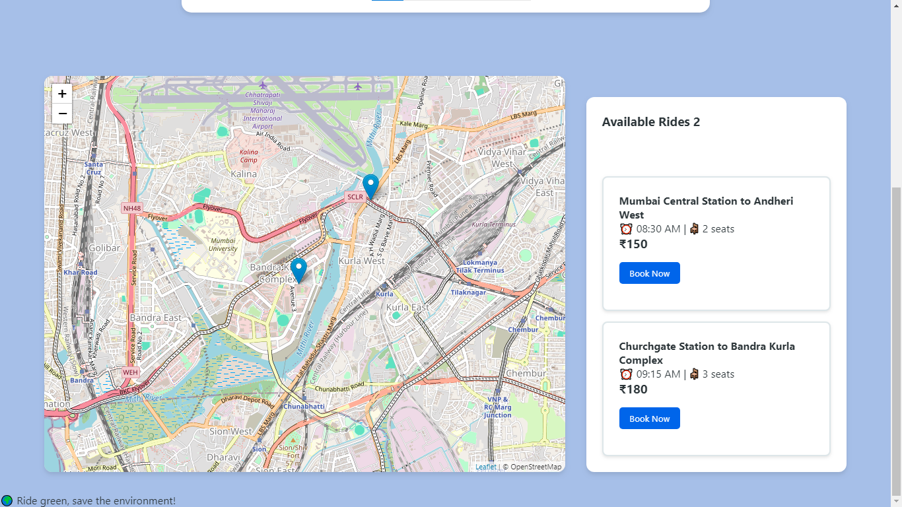

# 🚗 RideShare – A Smart Cab Sharing Web App
RideShare is a cab and auto rickshaw sharing web app designed to connect commuters who are traveling in the same direction.
It allows flexible ride booking, transparent cost splitting, and promotes eco-friendly, community-based travel.
It also integrates Google Maps API for location tracking and the user only needs to pay for the distance he travelled.
<br>

## 🚀 Live Demo
[Click here](https://ommore86.github.io/RideShare/) to get the live demo of the webpage.
<br>

## 📸 Screenshots


<br>

## 🚀 Features
- 📍 Real-time location-based ride matching
- 👥 Share rides with others going in the same direction
- 💸 Split ride fare fairly and automatically
- 📝 Feedback and ride history tracking
- 📱 Fully responsive for mobile and tablet use

## 🛠️ Tech Stack
### Frontend:
- React + Vite
- Tailwind CSS

### Backend:
- Node.js + Express

### Tools & Services:
- Firebase (Authentication and Maps)
- Google Maps API
<br>

## 🧰 Getting Started
```bash
git clone https://github.com/ommore86/RideShare.git

cd RideShare
npm install
npm run dev

cd rideshare-backend
npm install
npm run dev
```
<br>

## 🤝 Let's Connect!
If you’d like to collaborate, give feedback, or just say hi — don’t hesitate to reach out or connect with me on [LinkedIn](https://www.linkedin.com/in/om-more-b802b2281/).
